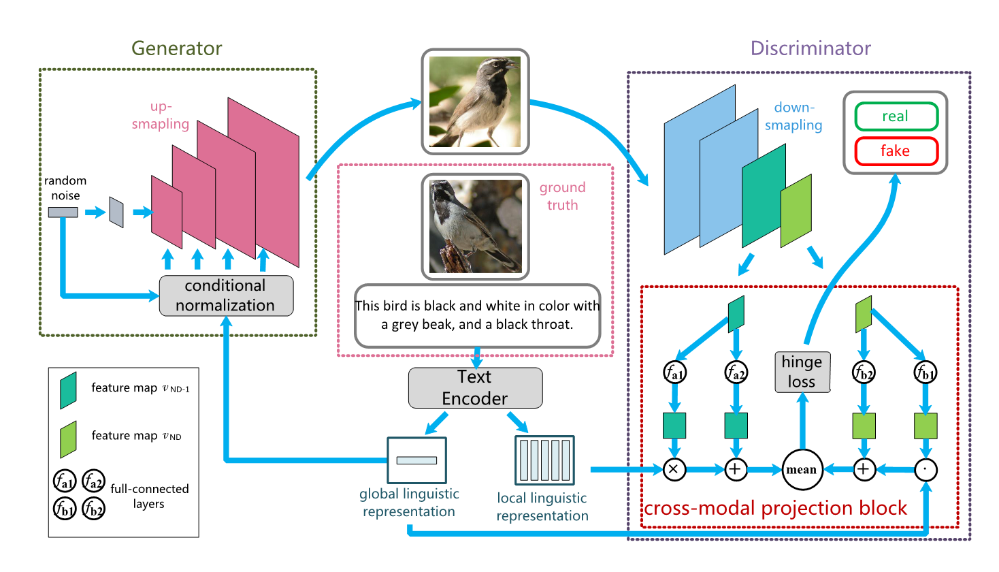
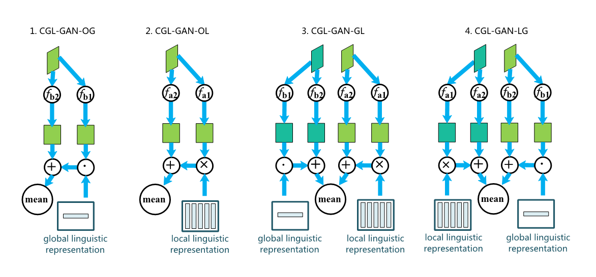
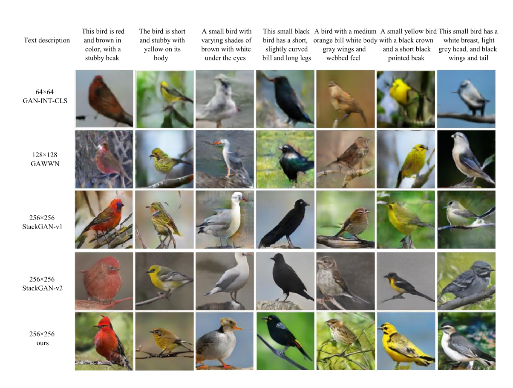
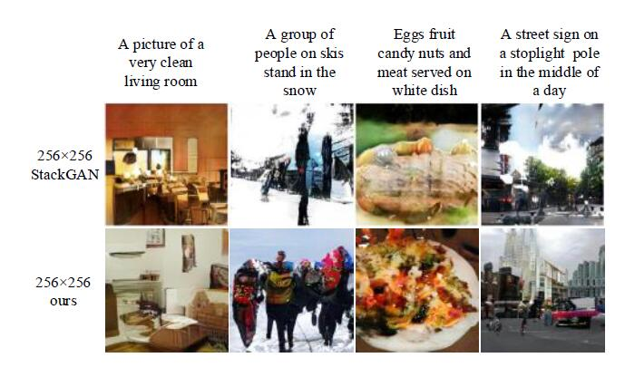
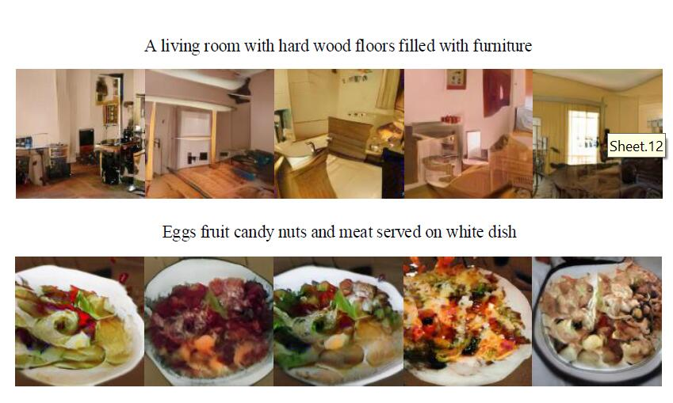
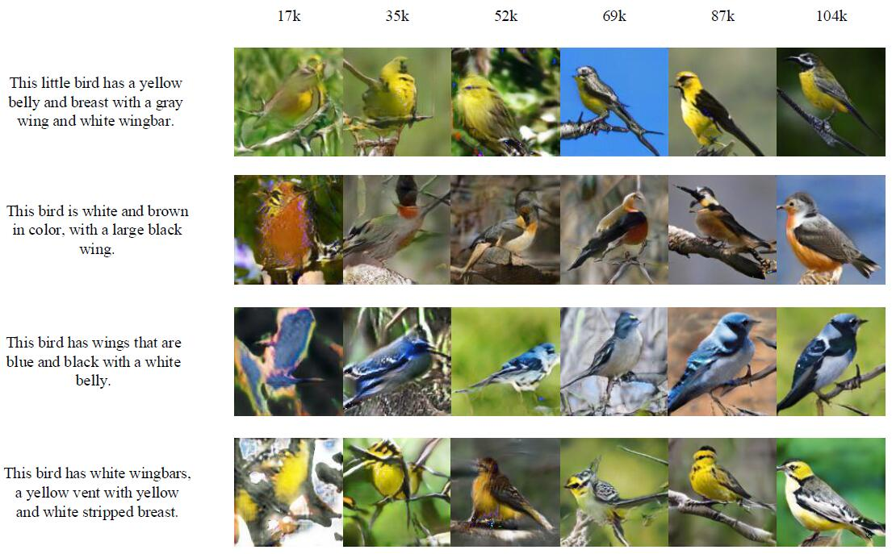

# txt2im
text-to-image synthesis in Pytorch

论文 Exploring Global and Local Linguistic Representation for Text-to-image Synthesis 代码实现

* text-to-image任务是根据一段文字描述来生成其对应的图片，主要技术是GAN和LSTM。
* 本论文将词信息通过shortcut的形式用作GAN的判别器中，和句子信息共同指导生成器训练。有效地防止了判别器的退化现象，稳定GAN的训练同时提升了text-to-image生成模型的效果。本文还发现不同粒度（句子-词）的语言信息和图像信息在结合顺序上也影响GAN的训练，并实验证明了这一结论。我们提出的模型不仅具有state-of-the-art的Inception Score指标，同时训练参数缩减了一个数量级。

训练代码在 [code目录](./code) 下

测试代码在 [test目录](./test) 下

## model overview：

通过修改CPB，测试对比仅使用global表示，仅使用local表示，先global再local，先local再global四种情况对图像生成的影响。结构如下：

## CUB images generated by our model compaired with other methods:

## COCO images:

## Different images conditoned on same text descriptions:

## images on iterations:
